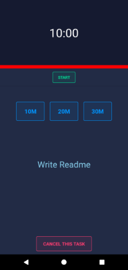
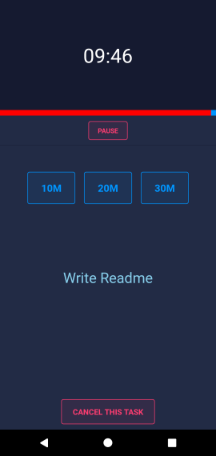

# FocusTime 

> Android app to keep you focused

## Features

- Allows the user to create a task
- Allows the user to set time(10/20/30 minutes) to focus on the said task
- Let user cancel task any time
- Keeps track of task history
- Task history can be cleared when the mess is big

## Run Locally

1. Clone this repository using `git clone https://github.com/abdus/focus-time.git`
2. Change directory to `focus-time`
3. Install dependencies using `yarn`
4. Start Metro server by running `yarn start`
5. Install and Start App by running `yarn android` (in a separate terminal)

> If you just want to try out an APK, you can find it in [release page](https://github.com/abdus/focus-time/releases/tag/v0.0.1-alpha).

## Screenshots

## Built With

- [React Native](https://reactnative.dev/)
- [Eva Design](https://eva.design/)
- [UI Kitten](https://akveo.github.io/react-native-ui-kitten/)
- [NeoVim](https://neovim.io)

## License

Source code is licensed under [GPL-3.0 License](https://github.com/abdus/focus-time/blob/main/LICENSE)

## Attributions

Feature-wise, this app is same with the one from [Complete React Native Developer in 2021: Zero to Mastery](https://academy.zerotomastery.io/courses/1050496).
I took my own path for the codebase.

## Similar Projects

- [geanu02/focus_time](https://github.com/geanu02/focus_time/)
- [Sankti/FocusTime](https://github.com/Sankti/FocusTime)
